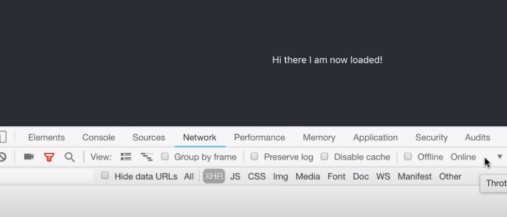

## Suspense for Data Fetching (Experimental)

<h5>
Caution:

This page describes experimental features that are not yet available in a stable release. Don’t rely on experimental builds of React in production apps. These features may change significantly and without a warning before they become a part of React.

This documentation is aimed at early adopters and people who are curious. If you’re new to React, don’t worry about these features — you don’t need to learn them right now. For example, if you’re looking for a data fetching tutorial that works today, read this article instead.

</h5>

 

React 16.6 added a <Suspense> component that lets you “wait” for some code to load and declaratively specify a loading state (like a spinner) while we’re waiting:

https://reactjs.org/docs/concurrent-mode-suspense.html - source!
[Express](https://reactjs.org/docs/concurrent-mode-suspense.html)

 
 

<h4> check the comment in step 4 (App.js) </h4>

